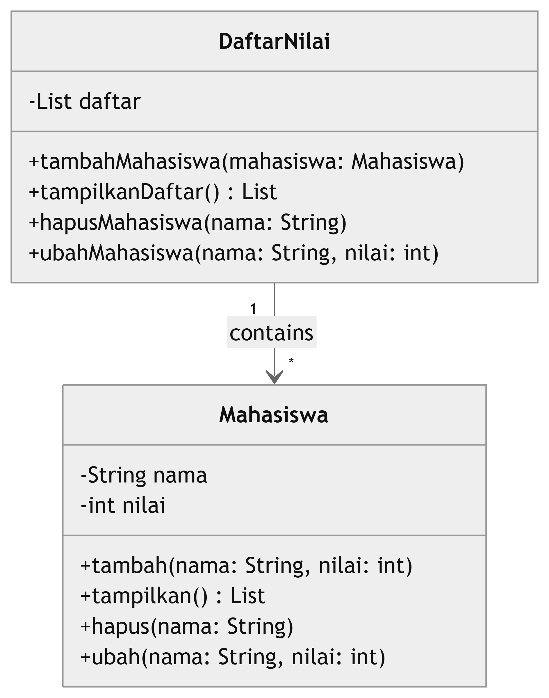

# LAPORAN PRAKTIKUM 8
DAFTAR ISI
==========
- [LAPORAN PRAKTIKUM 8](#laporan-praktikum-8) 
    - [PSEUDECODE PROGRAM DATA MAHASISWA](#pseudecode-program-data-mahasiswa)
    - [DIAGRAM DATA MAHASISWA](#flowchart-data-mahasisiswa)
    - [FLOWCHART DATA MAHASISWA](#flowchart-data-mahasisiswa)
    - [KESIMPULAN](#kesimpulan)

## PSEUDECODE PROGRAM DATA MAHASISWA
Berikut adalah penjelasan fungsi dan kegunaan dari setiap bagian dalam program Python yang mengelola data mahasiswa diantaranya

### Step 1 : Menginput Data
Dalam program code "Class Mahasiswa" ini berfungsi untuk Mendefinisikan class bernama Mahasiswa. Sedangkan code Method __init__ Merupakan konstruktor yang dipanggil saat objek dari class Mahasiswa dibuat. Di sini, kita menginisialisasi atribut data sebagai list kosong untuk menyimpan data mahasiswa.

### Step 2 : Menambahkan Data
Dalam Method tambah berfungsi ini menerima dua parameter yaitu nama dan nilai.

    -Menambahkan Data: Data mahasiswa (nama dan nilai) ditambahkan ke dalam list data dalam bentuk dictionary.
    -Output: Menampilkan pesan bahwa data mahasiswa berhasil ditambahkan

### Step 3 : Menampilkan Data
Fungsi ini digunakan untuk menampilkan semua data mahasiswa.

    -Cek Data Kosong: Memeriksa apakah list data kosong. Jika kosong, menampilkan pesan "Tidak ada data."
    -Menampilkan Data: Jika ada data, menggunakan enumerate untuk mendapatkan indeks dan data mahasiswa. Setiap mahasiswa ditampilkan bersama dengan nomor urutnya.

### Step 4 : Menghapus Data
Dalam program Method hapus: Fungsi ini digunakan untuk menghapus data mahasiswa berdasarkan nama.

    -Pencarian Data: Melakukan iterasi pada list data untuk menemukan mahasiswa dengan nama yang sesuai (pencocokan tidak sensitif terhadap huruf besar/kecil).
    -Penghapusan Data: Jika ditemukan, mahasiswa dihapus dari list dan menampilkan pesan sukses. Jika tidak ditemukan, menampilkan pesan bahwa data tidak ada

### Step 5 : Mengubah Data
Fungsi ini digunakan untuk mengubah nilai mahasiswa berdasarkan nama.

    -Pencarian Data: Melakukan iterasi pada list data untuk menemukan mahasiswa dengan nama yang sesuai.
    -Pengubahan Data: Jika ditemukan, nilai mahasiswa diperbarui dengan nilai_baru, dan menampilkan pesan sukses. Jika tidak ditemukan, menampilkan pesan bahwa data tidak ada.

### Step 6 : Main Program
Dalam Program ini Memastikan bahwa kode di bawahnya hanya dijalankan jika file ini dipanggil secara langsung, bukan sebagai modul.dan program Instansiasi untuk Membuat objek daftar_mahasiswa dari class Mahasiswa.

### Step 7 : Loop Menu
Program menggunakan loop while True untuk terus menampilkan menu hingga pengguna memilih untuk keluar.
Ada beberapa pilihan menu:

    1. Tambah Data: Memanggil fungsi untuk menambahkan data.
    
    2. Tampilkan Data: Memanggil fungsi untuk menampilkan semua data mahasiswa.
    
    3. Hapus Data: Memanggil fungsi untuk menghapus data mahasiswa.
    
    4. Ubah Data: Memanggil fungsi untuk mengubah data mahasiswa.
    
    5. Keluar: Menghentikan program.

### Step 8 : Input pengguna
Mengambil input dari pengguna untuk memilih menu yang diinginkan.

### Step 9 : Tambah Data
Jika pengguna memilih '1', program meminta nama dan nilai mahasiswa, kemudian memanggil method tambah untuk menambahkan data.

### Step 10 : Tampilkan Data
Jika pengguna memilih '2', program memanggil method tampilkan untuk menampilkan semua data mahasiswa.
Step 11

### Step 11 : Hapus Data
Jika pengguna memilih '3', program meminta nama mahasiswa yang ingin dihapus dan memanggil method hapus.

### Step 12 : Ubah Data
Jika pengguna memilih '4', program meminta nama dan nilai baru, kemudian memanggil method ubah.

### Step 13 : Keluar
Jika pengguna memilih '5', program menampilkan pesan bahwa program selesai dan keluar dari loop

### Step 14 : Validasi Pilihan
Jika input tidak valid (tidak sesuai pilihan yang ada), program menampilkan pesan bahwa pilihan tidak valid.

Program ini adalah aplikasi sederhana untuk mengelola daftar nilai mahasiswa. Dengan class Mahasiswa yang berisi metode untuk menambah, menampilkan, menghapus, dan mengubah data mahasiswa, serta antarmuka berbasis teks untuk berinteraksi dengan pengguna, program ini memberikan cara yang efektif untuk mengelola data.

### Hasil Output Program Data Mahasiswa
Berikut Hasil Output Program Saya yang menunjukkan interaksi pengguna dengan program manajemen data mahasiswa yang telah kita bahas sebelumnya. Mari kita analisis setiap bagian dari output tersebut secara berurutan

### Menampilkan Menu dan Memilih Opsi 1 (Tambah Data)

-*Dalam Program menampilkan menu Dapat Memilih lima pilihan*.

    -Pengguna memilih opsi 1 untuk menambahkan data baru.
    -Program meminta pengguna untuk memasukkan nama (Ali) dan nilai (85).
    -Setelah menerima input, program menambahkan data mahasiswa dengan nama "Ali" dan nilai 85 ke dalam daftar.
    -Muncul pesan konfirmasi bahwa data "Ali" telah berhasil ditambahkan.

### Menampilkan Menu dan Memilih Opsi 2 (Tampilkan Data)

-*Program ini menampilkan menu lagi*.

    -Pengguna memilih opsi 2 untuk menampilkan semua data mahasiswa.
    -Program menampilkan daftar mahasiswa, yang saat ini hanya berisi satu mahasiswa: "Ali" dengan nilai 85.

### Menampilkan Menu dan Memilih Opsi 3 (Hapus Data)

-*Program menampilkan menu sekali lagi*.

    -Pengguna memilih opsi 3 untuk menghapus data.
    -Program meminta pengguna untuk memasukkan nama mahasiswa yang ingin dihapus, dan pengguna memasukkan "Ali".
    -Program mencari mahasiswa dengan nama "Ali" dalam daftar dan berhasil menghapusnya.
    -Muncul pesan konfirmasi bahwa data "Ali" telah berhasil dihapus.

### Menampilkan Menu dan Memilih Opsi 2 (Tampilkan Data) Lagi

-*Program menampilkan menu lagi*.

    -Pengguna memilih opsi 2 untuk menampilkan data mahasiswa.
    -Program memeriksa daftar mahasiswa (self.data) dan menemukan bahwa tidak ada data yang tersisa (karena "Ali" telah dihapus).
    -Muncul pesan "Tidak ada data." untuk menunjukkan bahwa daftar mahasiswa kosong

### Menampilkan Menu dan Memilih Opsi 5 (Keluar)

-*Program menampilkan menu sekali lagi*.

    -Pengguna memilih opsi 5 untuk keluar dari program.
    -Program mencetak pesan "Program selesai." dan menghentikan eksekusi.

Dalam Output ini menunjukkan alur kerja program dengan baik, menggambarkan bagaimana pengguna dapat menambah, menampilkan, menghapus data mahasiswa, dan akhirnya keluar dari program. Interaksi ini mencerminkan fungsi dari metode yang ada dalam kelas Mahasiswa, serta bagaimana data dikelola dalam list self.data. Program berfungsi dengan baik sesuai dengan input dari pengguna dan memberikan umpan balik yang sesuai setiap kali ada aksi yang dilakukan.

## DIAGRAM DATA MAHASISWA
Diagram kelas Merupakan representasi dari kelas-kelas yang ada dalam sistem, relasi antar kelas, serta berbagai atribut dan metode yang dimiliki oleh masing-masing kelas. Dalam konteks program yang telah kita buat untuk pengelolaan data mahasiswa, berikut adalah penjelasan fungsi dan kegunaan dari diagram kelas yang telah dibuat sebelumnya.

Berikut Fungsi dan kegunaan data dalam diagram kelas diantaranya

## Kelas Mahasiswa
    - Fungsi: Kelas ini bertanggung jawab untuk mengelola data mahasiswa. Ia merupakan representasi dari entitas mahasiswa yang menyimpan informasi tentang nama dan nilai.
    -Kegunaan: Menyediakan struktur untuk menyimpan data mahasiswa dengan baik. Mempermudah organisasi data dalam satu objek (instance) daripada menggunakan variabel-variabel terpisah.

## Atribut: data List
    -Fungsi: Atribut ini adalah sebuah list yang digunakan untuk menyimpan data mahasiswa. Setiap elemen dalam list ini adalah dictionary yang berisi pasangan kunci-nilai untuk nama dan nilai.
    -Kegunaan: Menyimpan semua data mahasiswa yang telah ditambahkan, sehingga dapat dengan mudah diakses dan dimanipulasi melalui metode yang tersedia. Memfasilitasi pengelolaan data yang terstruktur, dapat ditambah, dihapus, dan diubah.

## Metode: tambah(nama, nilai)
    -Fungsi: Method ini memungkinkan pengguna untuk menambahkan mahasiswa baru ke dalam daftar.
    -Kegunaan: Memudahkan penambahan data baru tanpa mengubah struktur data yang sudah ada. Menginformasikan tentang keberhasilan atau kegagalan penambahan data.

## Metode: tampilkan()
    -Fungsi: Method ini digunakan untuk menampilkan semua data mahasiswa yang ada dalam list data.
    -Kegunaan: Memberikan cara untuk melihat semua data mahasiswa secara ringkas.Menginformasikan pengguna jika tidak ada data yang tersimpan.

## Metode: hapus(nama)
    -Fungsi: Method ini digunakan untuk mencari dan menghapus data mahasiswa berdasarkan nama yang diberikan.
    -Kegunaan: Memungkinkan pengguna untuk mengelola data dengan menghapus informasi yang tidak lagi relevan.Memberikan umpan balik kepada pengguna jika data yang dicari tidak ditemukan.

## Metode: ubah(nama, nilai_baru)
    -Fungsi: Method ini digunakan untuk mencari dan mengubah nilai mahasiswa berdasarkan nama yang diberikan i.
    -Kegunaan: Memfasilitasi pembaruan data mahasiswa, yang penting untuk menjaga keakuratan informasi. Memberikan umpan balik tentang keberhasilan atau kegagalan dalam mengubah data.

Diagram kelas memberikan gambaran yang jelas tentang struktur program, menunjukkan bagaimana data mahasiswa disimpan dan dikelola, serta metode apa saja yang dapat digunakan untuk berinteraksi dengan data tersebut. Ini sangat berguna dalam perancangan perangkat lunak karena membantu pengembang untuk memahami dan merencanakan bagaimana berbagai bagian dari sistem akan saling berinteraksi.

## FLOWCHART DATA MAHASISWA
Berikut adalah penjelasan fungsi dan kegunaan dari setiap langkah dalam flowchart yang telah diberikan sebelumnya untuk program daftar nilai mahasiswa diantaranya
### Step 1 : Start
Fungsi ini Menandakan titik awal dari proses program. Dengan ini pengguna dapat Menginformasikan bahwa program mulai berjalan dan semua proses akan dimulai dari sini.

### Step 2 : Inisialisasi Objek Mahasiswa
Fungsinya untuk Membuat instance dari class Mahasiswa.dengan ini flowchart dapat Menyiapkan struktur data untuk menyimpan informasi mahasiswa, termasuk nama dan nilai.

### Step 3 : Tampilkan Menu Pilihan
Fungsinya Menampilkan opsi menu kepada pengguna. Hal ini Memudahkan pengguna untuk melihat tindakan apa yang dapat dilakukan dalam program, seperti menambah, menampilkan, mengubah, atau menghapus data mahasiswa.

### Step 4 : Pilih Opsi
Fungsinya Mengambil input pilihan dari pengguna. dengan Memungkinkan pengguna untuk menentukan langkah selanjutnya dalam program berdasarkan keinginan mereka.

### Step 5 : Tambah Data

- *Masukkan Nama dan Nilai*:
  - Fungsi : Mengumpulkan data input dari pengguna.
  - Kegunaan: Menerima nama dan nilai mahasiswa untuk ditambahkan ke dalam daftar.

- *Tambahkan Data ke Daftar Mahasiswa*:
  - Fungsi : Memasukkan data yang dimasukkan oleh pengguna ke dalam struktur data yang sudah disiapkan.
  - Kegunaan: Menyimpan data mahasiswa secara terstruktur untuk diakses dan dikelola di kemudian hari.

- *Data berhasil ditambah*:
  - Fungsi : Memberikan umpan balik kepada pengguna.
  - Kegunaan : Memberitahu pengguna bahwa data telah ditambahkan dengan sukses.

- *Kembali ke Menu Pilihan*
  - Fungsi : Mengarahkan program kembali ke menu utama setelah menyelesaikan tindakan.
  - Kegunaan : Memungkinkan pengguna untuk melakukan tindakan lain tanpa perlu memulai ulang program.

### Step 6 : Tampilkan Data

- *Tampilkan Data*:
  - Fungsi: Menampilkan seluruh data mahasiswa yang telah terdaftar.
  - Kegunaan : Memberikan informasi kepada pengguna mengenai daftar mahasiswa dan nilai mereka.

- *Apakah Data Kosong?*:
  - Fungsi: Memeriksa apakah ada data yang tersedia.
  - Kegunaan: Mencegah pesan kesalahan jika pengguna mencoba melihat data tanpa data yang tersimpan.

- *Kembali ke Menu Pilihan*
  - Fungsi : Mengarahkan program kembali ke menu utama setelah menyelesaikan tindakan.
  - Kegunaan : Memungkinkan pengguna untuk melakukan tindakan lain tanpa perlu memulai ulang program.

### Step 7 : Ubah Data

- *Masukkan Nama dan Nilai Baru*:
  - Fungsi : Mengumpulkan input untuk mengubah data yang ada.
  - Kegunaan : Menerima informasi baru yang akan dipakai untuk mengupdate data mahasiswa.

- *Ubah Data Mahasiswa*:
  - Fungsi : Melakukan perubahan pada data yang ada berdasarkan input pengguna.
  - Kegunaan : Memungkinkan pengguna untuk memperbarui informasi mahasiswa yang mungkin telah berubah.

- *Apakah Data Ditemukan?*:
  - Fungsi : Memeriksa keberadaan data sebelum melakukan perubahan.
  - Kegunaan : Mencegah kesalahan saat mencoba mengubah data yang tidak ada.

- *Kembali ke Menu Pilihan*
  - Fungsi : Mengarahkan program kembali ke menu utama setelah menyelesaikan tindakan.
  - Kegunaan : Memungkinkan pengguna untuk melakukan tindakan lain tanpa perlu memulai ulang program.

### Step 8 :  Hapus Data

- *Masukkan Nama yang Akan Dihapus*:
  - Fungsi : Mengambil input dari pengguna untuk menentukan mahasiswa mana yang akan dihapus.
  - Kegunaan : Memungkinkan pengguna untuk memberikan nama mahasiswa yang datanya ingin dihapus.

- *Hapus Data*:
  - Fungsi : Menghapus data mahasiswa dari daftar.
  - Kegunaan : Memungkinkan pengelolaan data yang lebih baik dengan menghapus data yang sudah tidak relevan.

- *Apakah Data Ditemukan?*:
  - Fungsi : Memastikan bahwa data yang akan dihapus ada di dalam daftar.
  - Kegunaan : Menghindari kesalahan penghapusan data yang tidak ada.

- *Kembali ke Menu Pilihan*:
  - Fungsi : Mengarahkan program kembali ke menu utama setelah menyelesaikan tindakan.
  - Kegunaan : Memungkinkan pengguna untuk melakukan tindakan lain tanpa perlu memulai ulang program.

  ### Step 9 : Keluar
Fungsinya untuk Mengakhiri program.Hal ini Memberikan opsi kepada pengguna untuk keluar dari program setelah selesai menggunakan.

  ### Step 10 : End
Fungsinya Menandakan titik akhir dari proses program. dengan ini Menyatakan bahwa semua operasi telah selesai dan tidak ada lagi proses yang akan dijalankan

Setiap langkah yang ada dalam flowchart memiliki fungsi spesifik dan kegunaan yang jelas, tidak hanya untuk membantu pengguna memahami proses tetapi juga untuk memastikan pengoperasian program dapat dilakukan dengan efisien dan tanpa kesalahan. Flowchart ini mendemonstrasikan logika pemrograman dengan cara yang teratur, memudahkan pengembangan, pemeliharaan, dan pemahaman program secara keseluruhan.

## KESIMPULAN
Dalam tugas ini,saya telah berhasil membuat sebuah program sederhana yang menggunakan konsep pemrograman berorientasi objek (OOP) dengan Python. Program ini dirancang untuk mengelola data mahasiswa, memungkinkan pengguna untuk menambah, menampilkan, menghapus, dan mengubah data mahasiswa melalui antarmuka berbasis teks.Selain itu mahasiswa tdapat memperoleh pemahaman yang lebih baik tentang bagaimana menerapkan konsep OOP dalam pengembangan aplikasi serta pentingnya pengelolaan data dengan cara yang terstruktur. Program ini juga menjadi dasar yang baik untuk pengembangan aplikasi yang lebih kompleks di masa mendatang.
